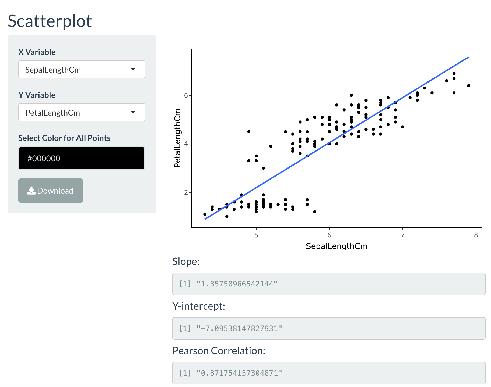
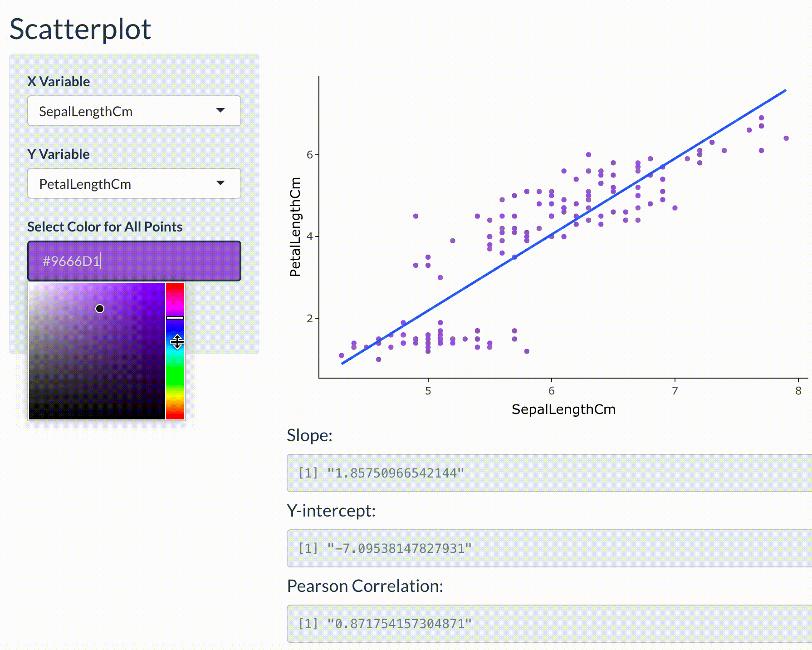

# How to use the 2D Plots Tab of dAbLication

The 2D Plots are to specifically generate the following plots that are held within their own sub-tab:

* A generic scatterplot
* A scatterplot with categorical data as colors/hues
* Jitterplot 
* Boxplot
* Histogram
* Violin Plot

Each sub-tab will be explained more in-detail in the following. 

### Scatterplot

Click on the **2D Plots** tab, and then go to the **scatterplots** sub-tab. There, the user has the option to choose which feature to plot as the independent and dependent features. The plot also calculates for the slope and y-intercept values. It also calculates for the Pearson correlation value and gets outputted. 

The user also has the option to change the color of the points. This is displayed in the short clip below. The user can choose the colors accordingly. This feature is also available in the **Histogram** plot sub-tab.

In addition to this user option, the plot that is generated is created from plotly. Plotly plots allow users to interact with the plot. Upon hovering the mouse, a popup appears to display the information that gets provided. A download button is available on the bottom-lefthand side for the user to save the plot to a local folder as an png file.

### Categorical Scatterplot

This sub-tab differs from the one above in that the points on the plot could be differentiated by a categororical feature by the user. There are no calculated values, and the tab is solely for visualization. The user, like the Scatterplot tab, chooses the independent and dependent features to plot. They can also select the categorical feature. The plot will automatically take these input selections and generate the plot for the user. There is also a download button available to save the plot as a png file into a local folder of the users' choice as well.

