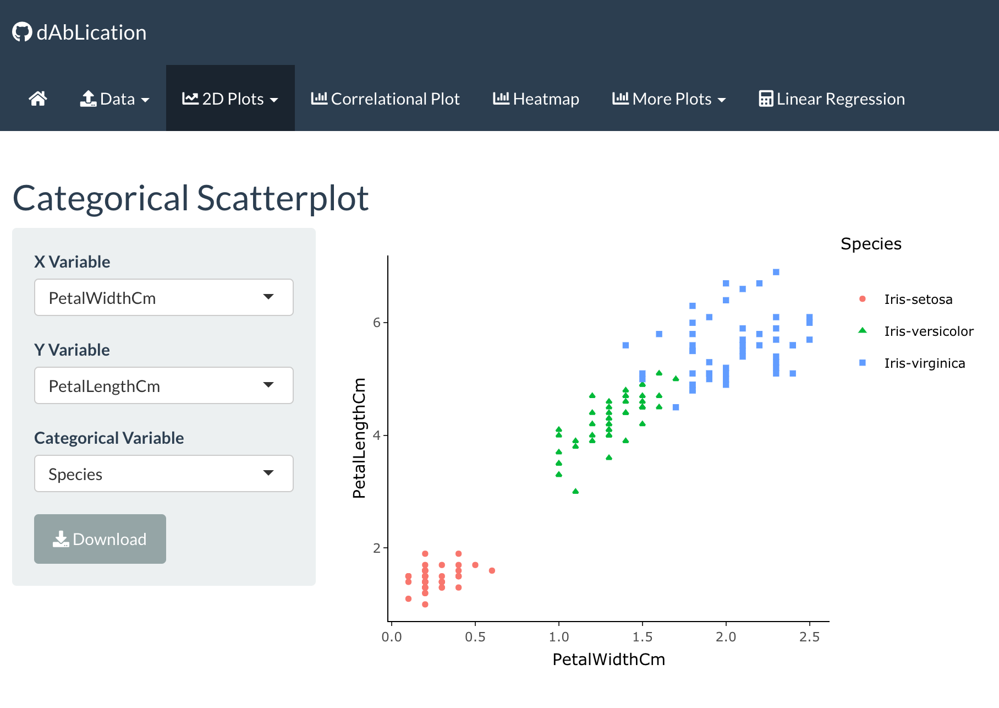
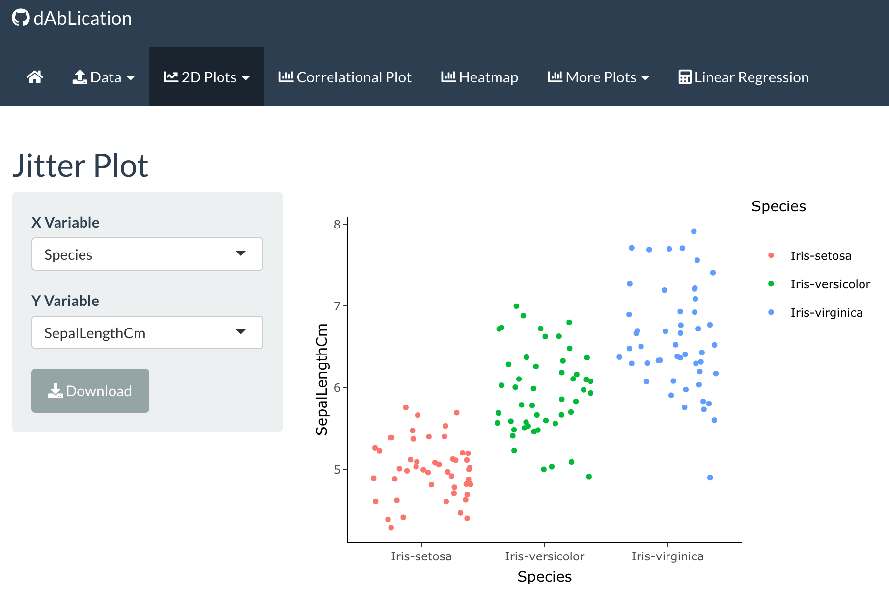
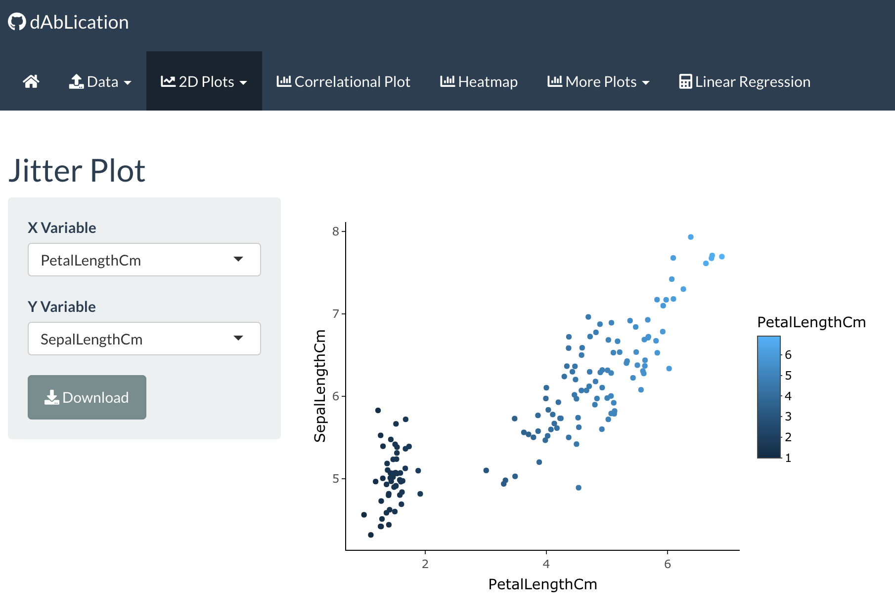
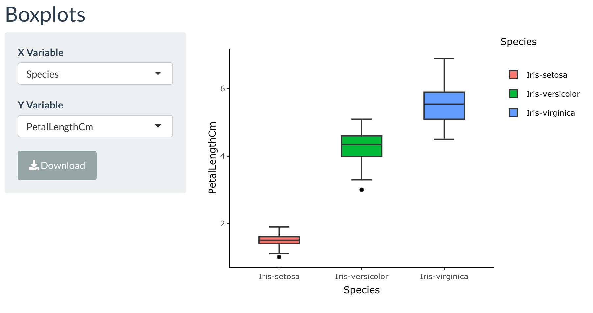
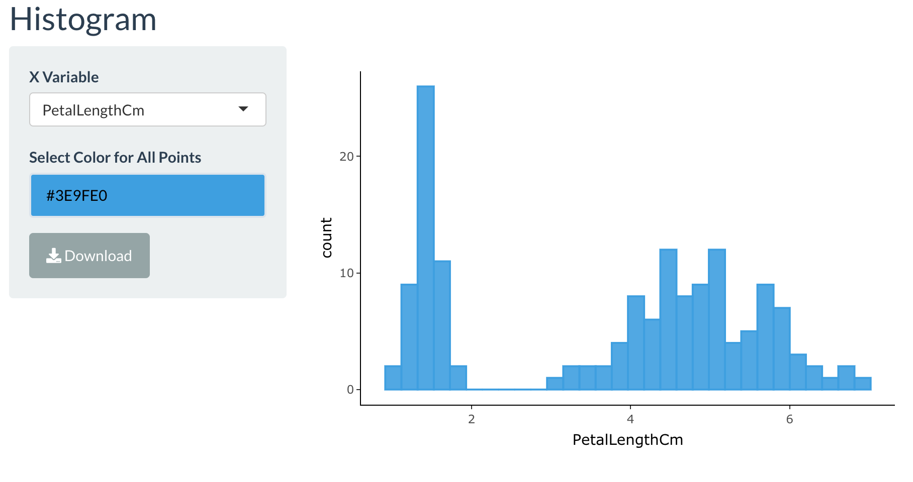
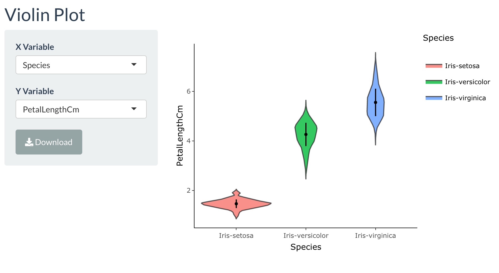
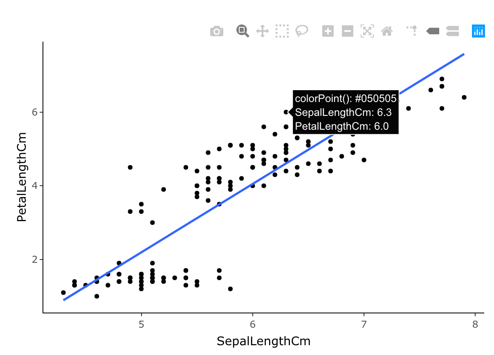

# How to use the 2D Plots Tab of dAbLication

The 2D Plots are to specifically generate the following plots that are held within their own sub-tab:

* A generic scatterplot
* A scatterplot with categorical data as colors/hues
* Jitterplot 
* Boxplot
* Histogram
* Violin Plot

Data is taken from the uploaded file from the **Data** tab. Data must be uploaded before anything can be plotted in the application. If the Data is in the **head** format, only those 10 rows will be taken into consideration. Make sure to select the **All** option to depict the whole data within the **Upload File** sub-tab. Each sub-tab will be explained more in-detail in the following. 

### Scatterplot

Click on the **2D Plots** tab, and then go to the **scatterplots** sub-tab. There, the user has the option to choose which feature to plot as the independent and dependent features. The plot also calculates for the slope and y-intercept values. It also calculates for the Pearson correlation value and gets outputted. 

The user also has the option to change the color of the points. This is displayed in the short clip below. The user can choose the colors accordingly. This feature is also available in the **Histogram** plot sub-tab.

In addition to this user option, the plot that is generated is created from plotly. Plotly plots allow users to interact with the plot. Upon hovering the mouse, a popup appears to display the information that gets provided. A download button is available on the bottom-lefthand side for the user to save the plot to a local folder as an png file.

### Categorical Scatterplot

This sub-tab differs from the one above in that the points on the plot could be differentiated by a categororical feature by the user. There are no calculated values, and the tab is solely for visualization. The user, like the Scatterplot tab, chooses the independent and dependent features to plot. They can also select the categorical feature. The plot will automatically take these input selections and generate the plot for the user. There is also a download button available to save the plot as a png file into a local folder of the users' choice as well.

### Jitter Plot

Click on the sub-tab **"Jitter"** for this 2D plot type. Here, the user gets to do plot the scatterplot of the distribution for the categorical features if they wish to. Otherwise, the user could color the points as a third feature in this plot instead. The user selects the features to plot like the Scatterplot sub-tabs above. 

The first image is that of the distribution of categorical features as plotted via plotly. This plot is interactive and information gets displayed here for the values. 

The second image is that of the color of the points being by a third feature. This is also generated via plotly and is interactive.

The download button here also allows the users to save the plot as a png file. 

### Boxplot

To access this sub-tab, just click on the sub-tab named **Boxplot**. Here, the user can select the independent feature, which has to be a categorical feature, and the dependent feature, which is a numerical/continuous feature. This plot generates a boxplot via plotly, and therefore interactive, Clicking on the categorical feature in the legends section will help with interactions as well. The image below depicts how this appears with the Iris data set. 

The download button allows users to save the plot as a png file on a local folder.

### Histogram

To access this sub-tab, the user clicks on the sub-tab **Histogram**. Once the user accessed the page, the user selects the feature to depict the distribution in a histogram format. 

The download button is here as well and the users can save the plot as a png file format.

### Violin Plot

To access this sub-tab, the user clicks on the sub-tab **Violin Plot**. In this sub-tab, the plot is very much like the boxplot sub-tab where the user selects the independent and dependent features.The independent feature must be a categorical feature, while the dependent feature must be a numerical/continuous feature.

This plot is generated via plotly as well and thus interactive. To download the image, make sure to click the Download button for the png format.

## Working with Plotly in this Tab

Plotly is essentially an interactive graphing library. It is free to use in R and Python. Plotly plots within the application allow various different interactions, and they will be described below.

As the image shows, there is a camera button. This button is for downloading the plot to a local folder. However, the difference from the application's separate **Download** button is that plotly's download does it in a lower resolution and thus does not return a sharp and clean image. Upon clicking the camera icon, the user can download the image into a local folder. 

The other buttons allow the user to zoom into the plot via selection of a section of the plot or the other buttons. The users are encouraged to play around with the buttons. There is also a reset button that allows the users to refresh the plot with the same features plotted to show the entire plot. 

As shown by the image, hovering over the points shows the informational popup with the values of interest. 

