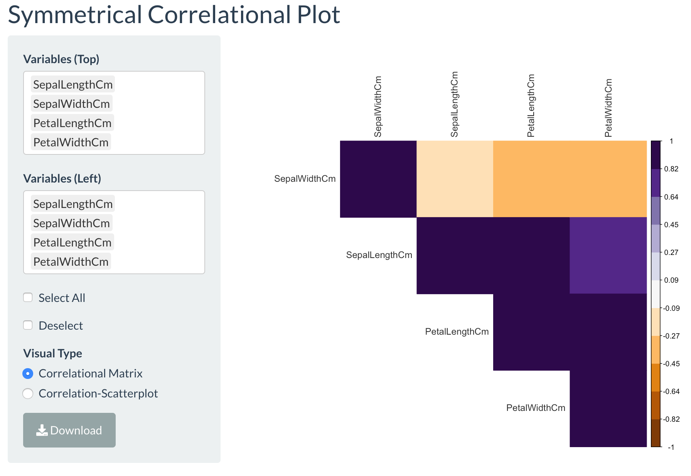
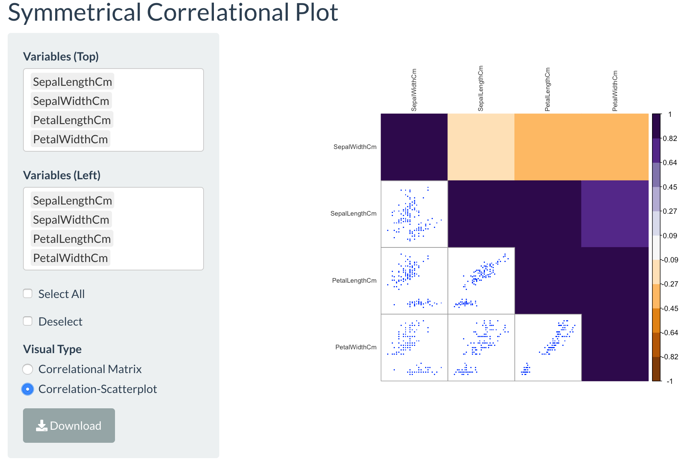

# Correlational Plot Tab

Upon clicking the **Correlational Plot** tab, the user can visualize correlational matrix in the application. The numerical data is taken in from the **Data** tab. And then the user is allowed to choose the features they wish to visualize as a correlational matrix. The minimum number of features the user must choose for **Variables (Top)** and **Variables (Left)** must be 2 features. The features could be different from each other on both sides of the matrix, as long as the top and left features are equal in number. 

For example, the application will return an error message indicating that there is an uneven number of features selected if the user chose 7 features for the top section, but only 4 features for the left section. An error message will take place if the number of selected features is less than 2 features. 

If all features are plotted, a quick way to do this is to click on the **Select All** button. Beware for the *ID* column. Some data files have the *ID* column set as a numerical one, and the user must unclick the **Select All** button to remove it. The other features will remain as selected, so do not worry about having those erased. If the user does wish to remove all the previously selected features, the **Deselect** button suffices. However, if the user wishes to select features again, this must be unclicked. 

In the perchance the user wishes to just remove one feature from selection, then they can manually just click on that feature and hit delete or backspace. 

The image below is the standard correlational plot generated for the Iris data set. To display this type of correlational matrix, the user should go under the **Visual Type** and click the **Correlational Matrix**. 

Another type of visualization of the correlational matrix is that with scatterplot plots of the two features on the correlational matrix. This is displayed below.

A separate repository was made and uploaded the code for the correlational matrix that also illustrates the scatterplot. There is no pre-made R function for this, so this was coded and generated for research purposes and made publicly available. The link to the code file is below:

[R Correlational Scatterplot Code](https://github.com/heejoon123/Correlation_Scatter/blob/master/scatcor_git.R)

The code is commented to help the user understand the code a little better. 
