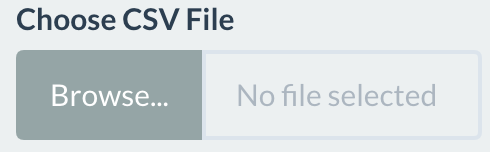
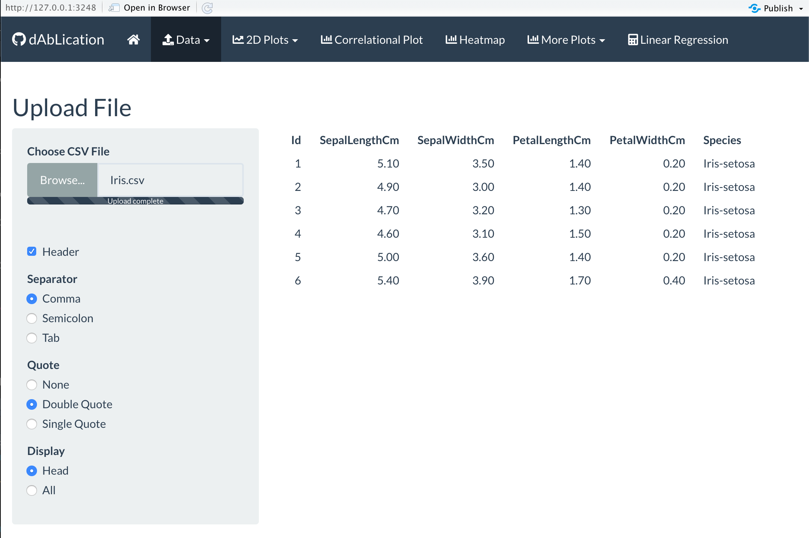
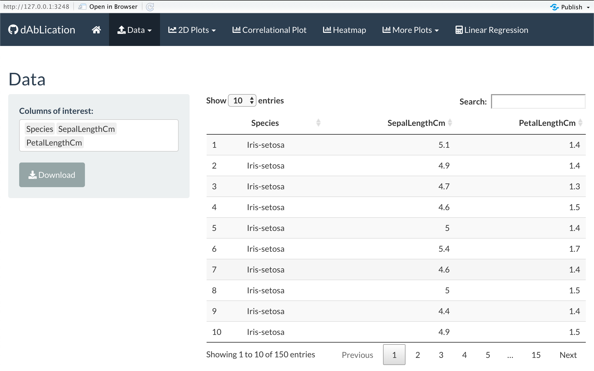

# Data Tab Tutorial

### Upload Data
This is a tutorial page to explain how to utilize the Data Tab in dAbLication generated with shiny! To first access the Data Tab, please click on the "Data" tab, and then to the sub-tab that says "Upload File". 

Once there, the first step is to upload the data. All data that is compatible with this application must be in a csv file format. There is a button on the left-hand side that says . 

Click the button to create a popup menu for a local folder. Then go to the local directory that holds your data file. Once there, click on the csv file that you wish to explore. Doing so will automatically upload the data and you should be redirected to the application. 

With the use of an example dataset, the common, and publicly available Iris Data set, the image below illustrates the main page of the application with the user options available. 

On the lefthand side below there are options for the type of csv upload. These are to be done before the actual upload. On most instances, this is preset to allow users to upload with convenience, but if not, please pre-set the options below for minimal work. The **Header** checkbox indicates whether the csv file being uploaded has headers. The options for the **Separators** should not be changed if the standard csv file is utilized. It is set to determine that the separators for csv files are automatically commas. The **Quote** option is for strings. Most datasets use the standard double quote symbols of " ". However, in the case that there are single quote strings, ' ', then make sure to change this if for convenience sakes. 

Lastly, the **Display** user option is set to display the **head** option. Once the file is uploaded, this automatically displays the first 10 rows of the data to limit the overload of a huge dataset if the main goal is to make sure the dataset gets loaded in. However, if analysis on the full dataset is preferred, just click on the **All** button and this should display all rows. The user can scroll with their mouse to keep looking at all the rows. 

However, this could be entirely cumbersome, and the user may want the full dataset of all rows, but just a select number of columns to look at in the data table format. To do this, the user can click on the other sub-tab, **Handle Data**.

### Handle Data

In this sub-tab, the user can select the columns of interest that they wish to see, and display it in a cleaner format. The image below depicts how the preset table displays only selected columns from the options. There is a search box that allows interaction with the data set for search purposes. The number option is the option of how many rows could be displayed in one setting. The preset is 10 rows, but the user can also click on the different numbered "pages" of the data to look through the data. This version of the data can be saved as a csv file onto a local folder if the user wishes to take this new dataset and save it.

From here, the user can then move onto the other tabs for data visualization basic statistical analysis.

