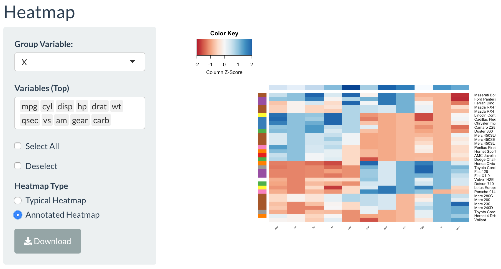

# Heatmap Tab

Click on the **Heatmap** tab. Once there, the user chooses the numerical/continuous features of interest. The **Select All** button and **Deselect** buttons are provided like the **Correlational Plot** tab for ease of use on the user if the dataset is large. Here, the users are able to take each different individuals as the rows and the continuous features are selected. The user can choose each of the numerical/continuous features from the list. 

There are two types of heatmaps that could be illustrated. There is the standard heatmap with the dendograms and there is the annotated heatmap. The images below show the heatmaps with the publicly available mtcars. 

The first image is for the standard heatmap. This information is easily depicted in R with the typical heatmap() function. But in the situation that the user does not wish to handle the data any further, this is just the quick and easy version to do so. 

The second image is an annotated version of the first heatmap. The colors on the top and the side depict the groups that the subjects and the features are in. 

