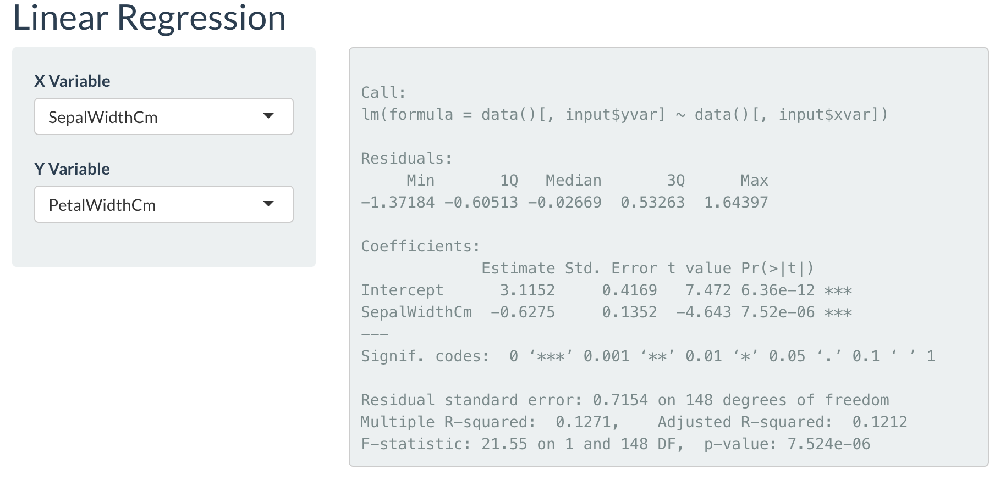

# Linear Regression

The statistical calculation created for exploration of association was set so that the user could set a very basic linear regression based on the **lm()** function of R. The application takes in one independent feature and one dependent feature for the calculation. This is a simple and easy linear regression and the user gets to look at the output that R typically generates from the **summary()** function of the **lm()** output. 

Documentation for the mentioned R functions are provided in the links below:

[summary function (R)](https://www.rdocumentation.org/packages/base/versions/3.6.2/topics/summary)

[lm function (R)](https://www.rdocumentation.org/packages/stats/versions/3.6.2/topics/lm)

The image below depicts a simple linear regression output for the Iris dataset.

