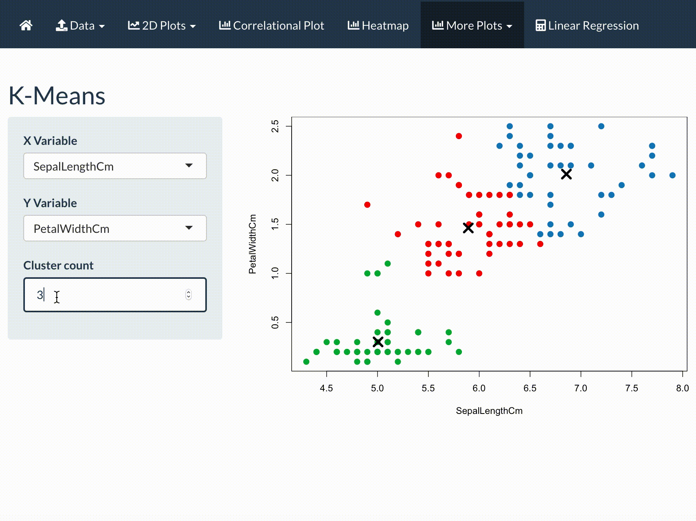
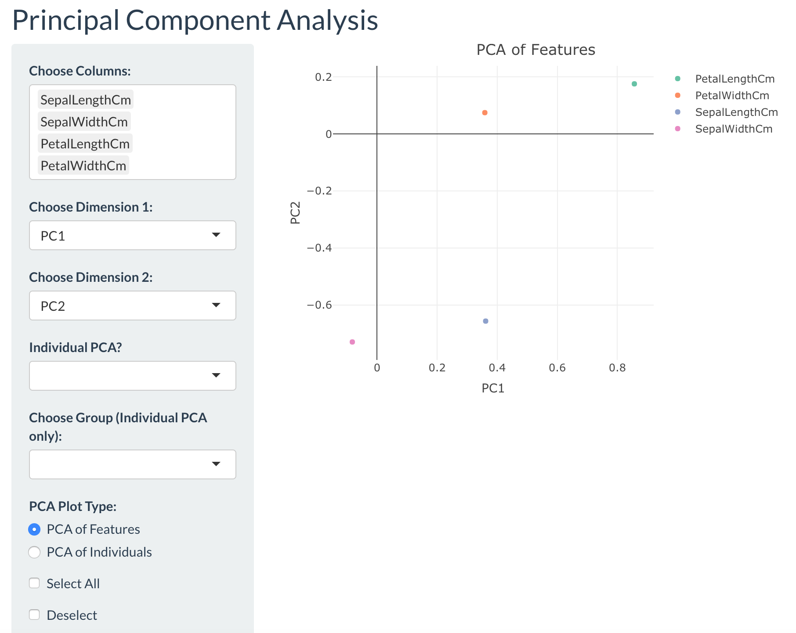
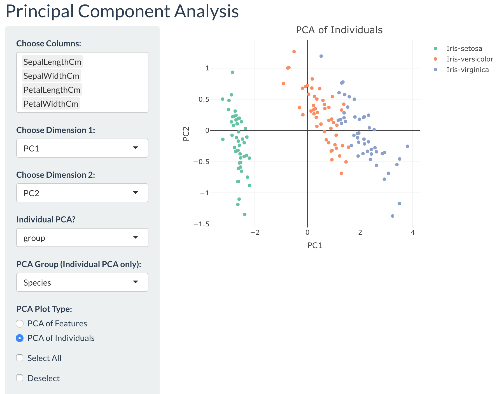
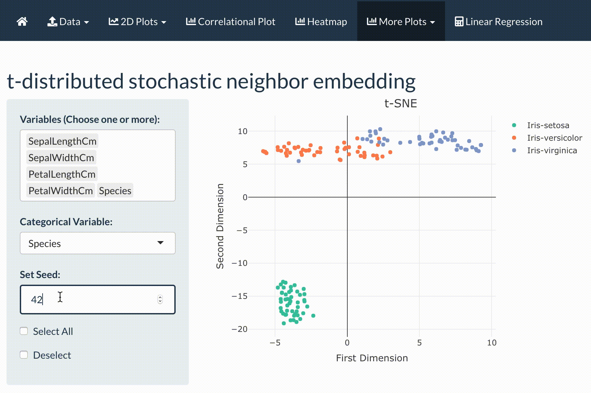

# More Plots Tab

If the user wished to try additional visualization for feature reduction and clustering, the user should click on the **More Plots** tab. The three sub-tabs are explained more in-depth below.

###  K-Means Clustering

To conduct K-Means clustering, the user must click on the correct sub-tab with the name. K-Means Clustering is another visualization type of data. Here numerical/continuous features are provided as options to the user to plot as dependent and independent features. The numerical user input that the user could choose must have a minimum of 1 but could go beyond. The **X** marks the centroid of each cluster that got calculated by the algorithm. 

A more in-depth explanation of k-means clustering is provided in the link below to show how the algorithm was coded for this application.
[Wikipedia k-means clustering](https://en.wikipedia.org/wiki/K-means_clustering)

The following video illustrates how the the centroids change based on the number of clusters the user wants to see. 

### Principal Component Analysis (PCA)

To conduct PCA, the user must click on the correct sub-tab for **PCA**. This sub-tab does a feature reduction method that a lot of researches use. The option here is for the user to choose the features of interest to take into consideration for the feature reductions.

The first step is to look at the PCA options. Whether to plot the features or all the individuals. The initial PCA plot that is set is the feature PCA, thus only allowing the first three user inputs to be taken into consideration. The feature selection methods look at the "columns" of the dataset, where they then conduct the PCA and then plot them as a scatterplot via plotly. 

Once the features are selected, the user can then change which dimensions to look at. The most common dimensions to study are first and second dimensions. 
The image of a PCA plot of the Iris data set is shown below.

The PCA for each subject/individual represented in the dataset is different in that the user must select the features and the categorical feature (from the very last user input for features) of interest before changing the dimensions. The third user input could be ignored as it automatically updates once the fourth user input for the categorical feature is done. Once those are all chosen the dimensions come in last to display the plots for various dimensions. The image shows how this PCA appears for the Iris data set. This plot is also generated via plotly.

### t-distributed Stochastic Neighbor Embedding (t-SNE)

An interesting feature reduction method that was utilized as an option for users to play around with was R's version of the t-distributed stochastic neighbor embedding (t-SNE). Here, the users select the numerical/continuous features, and one categorical feature of interest. In doing so, the categorical feature plots the points based on the categorical feature for the feature reduction. The number of *"seeds"* for this method is up to the user. The video below shows how the plot changes based on the number of seeds, and the ideal number is up to the user's preference. However, the pre-set number of seeds is 42 in the application.

However, this method was based on R's function for t-SNE and not fully identical to the generic t-SNE code for Python. This visualization is more for exploration. 

